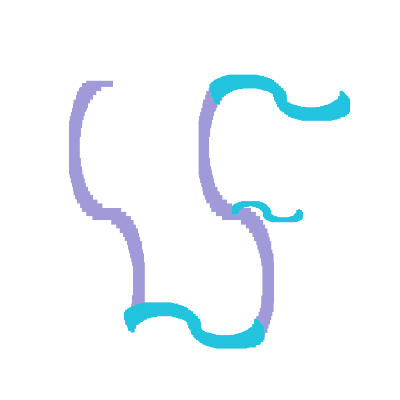
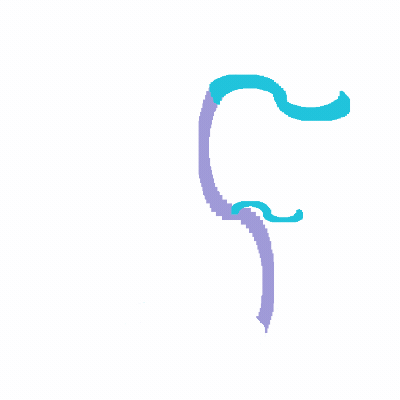

  
  
  

<!--https://readme-typing-svg.herokuapp.com/でタイピングしてる風のSVGを作成しています-->

## 音声・アクセシビリティに関するアプリ・技術開発が得意です！

---

<!-- プロフィール詳細カード -->

<!-- リポジトリごとの言語棒グラフ -->

<!-- コミットの時間帯ごとのグラフ -->

## 🦻 主な得意分野・テーマ
- 音声信号処理
- 補助技術・アクセシビリティツール開発
- リアルタイム音声認識・文字起こし
- Webアプリ開発

---

## 🛠 よく使う

## 🤝 触ったことがある

## 👀 気になっている

---

## 🚀 代表的な成果物
- [ColorAssist](https://github.com/shotafujie/ColorAssist)：画像コントラストチェック
- [BlowWords](https://github.com/shotafujie/BlowWords)：話した言葉をシャボン玉っぽく画面表示(技育Camp成果物)
- [SoundHue](https://github.com/shotafujie/SoundHue)：音のスペクトルを可視化&振動提示
- [asrivia](https://github.com/shotafujie/asrivia)：ローカルで文字起こしができて，PiP表示や翻訳もできる
- [arXiv2Discord](https://github.com/shotafujie/arXiv2Discord)：arXiv APIで取得した論文タイトル・アブストを，GitHub ActionsによってPerplexity AIで要約し，Discordアナウンスチャンネルに自動投稿＆公開．

---

### 📝 ホームページ
[fujiemon.dev](https://fujiemon.dev/)

---

🌱 聴こえに関係なく発言できる，伝わる環境づくりをモットーにろう・難聴者のための音声コミュニケーションの支援に使えそうな技術の学習や実践，アプリ開発を行い，興味の赴くままに課題設定を行い手を動かしています．ご興味があるリポジトリがあればぜひForkして拡張・改善していただいたり，Issue投稿やPR作成大歓迎です．  
📝 スクラムやアクセシビリティに関するカンファレンス，ミートアップにいることが多いです．お気軽に絡んでくださるととても嬉しいです．推し本を教えてくれるととても喜びます．

---

## Support

このリポジトリが役に立った/気に入っていただけたら，以下のいずれかの形でサポートしていただけると嬉しいです🙌

- GitHubでのStar⭐
- SNS等でのシェア・紹介
- Buy Me a Coffeeからのご支援

If you find this project useful, you can support it in any of the following ways 🙌

- Give the repository a ⭐️ on GitHub
- Share it on social media or with your friends
- Support me on Buy Me a Coffee

